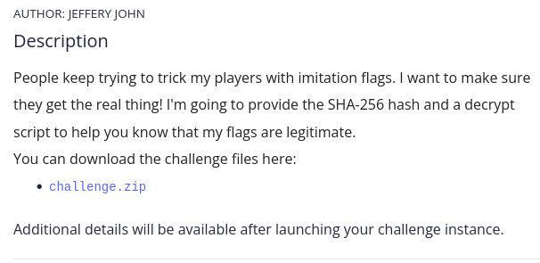
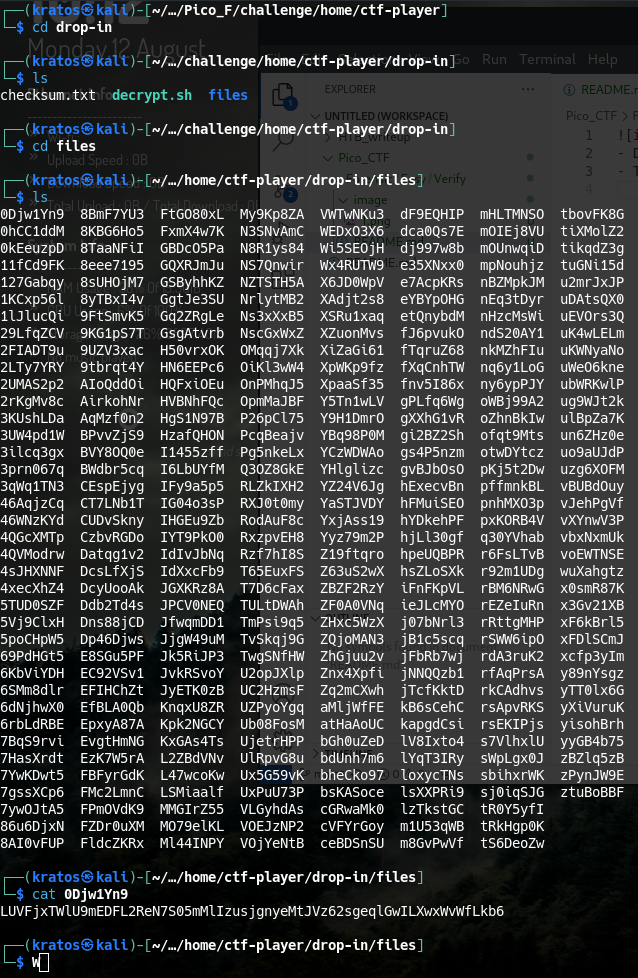
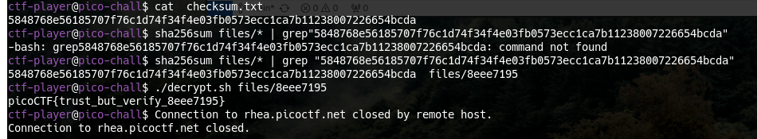

- Dề cung cấp 1 file checksum, 1 file decrypt.
- Tiến hành tải challenge.zip và giải nén ra.

- Giải nén ra được truy cập vào thì thấy thư mục file. Ls ra thì toàn thấy file được hash.

=> tìm file nào trùng với file checksum.txt

- cat  checksum.txt sẽ hiển thị 1 mã hash

```sha256sum files/* | grep "5848768e56185707f76c1d74f34f4e03fb0573ecc1ca7b11238007226654bcda" ```
- sha256sum files/* sẽ liệt kê các file trong thư mục files. 
- grep sẽ so sánh.
- kết quả: files/8eee7195
- sử dụng: ./decrypt.sh files/8eee7195 để giải mã